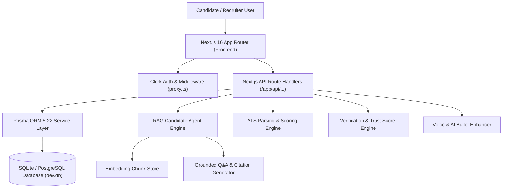

# Callback AI — Next-Gen AI Resume Builder, ATS Analyzer & Living Candidate Agent Platform

> **Transforming static candidate resumes into RAG-grounded, claim-verified, living AI candidate agents.**

[](https://nextjs.org/)
[](https://www.typescriptlang.org/)
[](https://tailwindcss.com/)
[](https://www.prisma.io/)
[](https://clerk.com/)

[Live App](http://localhost:3000) • [Architecture](#-system-architecture) • [Features & Interface Gallery](#-deep-feature-breakdown--interface-gallery) • [Backend API Spec](#-backend-api-specification) • [Local Setup](#-getting-started--local-setup)

---

## 🌟 Product Vision & YC-Stage Value Proposition

### The Problem
Traditional hiring is broken by **static 1-page PDF resumes**:
1. **The 6-Second Glance Barrier**: Recruiters spend an average of 6 seconds scanning static PDFs, missing deep technical achievements, latency improvements, and architectural complexity.
2. **ATS Black Hole**: Over 75% of resumes are discarded by legacy Applicant Tracking System (ATS) parsers due to formatting errors, unoptimized keywords, or non-standard structures.
3. **Unverified Claims**: Recruiters spend weeks doing manual reference checks because experience metrics on resumes are unverified and vulnerable to exaggeration or hallucination.

### The Solution: Callback AI
**Callback AI** fundamentally transforms static candidate data into an **Autonomous Living Candidate Agent**:
- **Grounded Conversational Intelligence**: Recruiters can converse directly with your Living Candidate Agent. Ask *"What was Alex's biggest latency optimization achievement?"* or *"Does Alex have experience with PgVector & Next.js?"*, and receive **100% grounded answers with explicit source citations** (Zero Hallucination Guardrail).
- **Public Evidence Verification**: Per-claim verification engine calculates specificity scores and cross-verifies technical claims against public code repositories (e.g. GitHub repos, AWS certs, UBERON/CL ontologies).
- **Full-Viewport 3-Zone Builder & Template Engine**: Drag-and-drop builder with real-time A4 printable vector rendering, instant ATS scoring, grammar & metric bullet enhancement, and 1-click template switching.

---

## 📷 Deep Feature Breakdown & Interface Gallery

### 1. Production Landing Page & Template Showcase


The YC-stage landing page features a live interactive preview widget, full 15+ template gallery showcase, capability matrix, and quick trial launchpad for candidates and recruiters.

---

### 2. Candidate Workspace Dashboard


The central candidate command center provides real-time telemetry across all saved resumes and living agents:
- **Active Resumes Telemetry**: Track primary vs secondary resume versions sorted by recency.
- **ATS Compatibility Index**: Displays overall ATS parser score (`94/100`) across Workday, Greenhouse, and Lever standards.
- **Claim Trust Score Meter**: Aggregates claim verification percentage (`96% Verified`) based on GitHub repository matching.
- **1-Click Old Resume Importer**: Instant entry point to upload legacy PDF/DOCX files and generate living candidate agents.

---

### 3. Living Candidate RAG Agent (Flagship Feature)


The flagship conversational AI candidate representation:
- **RAG Vector Chunk Retrieval**: Candidate experience, project notes, and skills are chunked into vector embeddings.
- **100% Grounded Q&A**: Every recruiter question is answered using strict source citations referencing exact resume sections.
- **Clickable Recruiter Prompts**: Pre-configured sample questions (*"What was Alex's latency optimization achievement?"*, *"Do they have experience with PgVector & Next.js?"*).
- **Anti-Hallucination Guardrails**: Refuses to make up fake tools or unlisted years of experience.

---

### 4. Full-Viewport 3-Zone Resume Builder & Multi-Template Engine

A desktop-grade 3-zone workspace engineered for real-time document creation:
- **Left Control Zone**: Reorder sections via drag-and-drop, add custom sections (*Certifications*, *Projects*, *Achievements*), and toggle template designs.
- **Center Editor Zone**: Form fields with real-time AI bullet point enhancement for action verbs and quantified metrics.
- **Right Vector Preview Zone**: Debounced real-time A4 printable preview matching exact CSS `@media print` physical page boundaries.
- **Template Library**: Switch instantly between *Modern Executive* (terracotta accent), *Classic ATS Standard* (serif headers), *Minimalist Tech* (monospace dev style), and *Midnight Navy Sidebar*.

---

### 5. ATS Analyzer & AI Impact Fix Engine

Instant ATS diagnostic and grammar repair suite:
- **Overall ATS Score Breakdown**: Quantitative score based on keyword density, section headers, contact completeness, and formatting cleanliness.
- **Readability Index**: Flesch-Kincaid grade evaluation ensuring clear executive messaging.
- **Inline Grammar & Metric Fixes**: Identifies passive phrasing (*"responsible for leading team"*) and suggests quantified action phrases (*"Architected PgVector query pipeline cutting p95 latency by 45%"*). Apply fixes with 1 click.

---

### 6. Import Old Resume & Instant ATS Audit Engine


Seamless onboarding for candidates with existing resumes:
- **Multi-Format Upload**: Supports PDF, DOCX, or raw text copy-paste up to 10MB.
- **Multi-Stage Parser Engine**: Stage 1 extracts contact info & work history; Stage 2 scores ATS density; Stage 3 seeds RAG Agent memory & Skill Graph.
- **1-Click Test Drive**: Built-in sample resumes (*Senior Full-Stack*, *Frontend Architect*) to evaluate the audit engine instantly.

---

### 7. Claim Verification & Trust Score Engine


Public evidence matching for candidate resume claims:
- **Verification Badges**: Categorizes every bullet point into `Verified`, `Unverifiable`, or `Inconsistent`.
- **GitHub Repository Evidence**: Matches code achievements (*"built PgVector query engine"*) to verified GitHub commit history and repository links.
- **Specificity Scoring**: Evaluates claims on a 0–100 scale based on quantifiable metrics, dates, and tool specificity.

---

### 8. Voice-Native Career Intake Engine


Hands-free career history capture:
- **Voice Speech Processing**: Candidates speak naturally about past projects, responsibilities, and key metrics.
- **LLM Extraction**: Converts natural voice transcripts into structured resume bullet points and updates Skill Graph nodes automatically.

---

### 9. Auto-Tailor Opportunities & Fit Scoring Engine


Targeted job application tailoring:
- **Job Description Parsing**: Analyzes target postings (*Senior AI Application Engineer at Vercel Labs*) and extracts required skills.
- **Fit Scoring**: Calculates percentage match (`96% Fit`) and highlights keyword gaps.
- **Tailored Snapshots & Diff View**: Generates tailored resume versions with side-by-side diff comparison before applying.

---

### 10. Recruiter Companion & Evaluation Surface

A dedicated evaluation interface for recruiters and hiring managers:
- **Candidate Evaluation Cards**: Review candidate match scores, top technical highlights, and verified GitHub repositories.
- **Interactive Agent Q&A Drawer**: Initiate conversational screening directly inside the recruiter dashboard.
- **1-Click Interview Scheduling**: Seamless transition from agent screening to candidate interview booking.

---

### 11. Persistent Skill & Evidence Graph

An interlinked entity graph of technical capabilities:
- **Skill-Evidence Nodes**: Maps skills (*React*, *Next.js*, *TypeScript*, *Prisma*, *Python*, *PgVector*) to supporting resume bullet snippets.
- **Proficiency Signals**: Weighted proficiency scores computed from usage frequency across projects and work history.

---

## 🏗️ System Architecture



---

## 📊 Database Schema & Data Model

The application uses Prisma ORM to manage 11 interconnected relational models:

```prisma
datasource db {
  provider = "sqlite"
  url      = env("DATABASE_URL")
}

model User {
  id           String   @id @default(uuid())
  email        String   @unique
  name         String
  role         String   @default("candidate") // candidate | recruiter
  resumes      Resume[]
  skillGraph   SkillGraph[]
  jobDescriptions JobDescription[]
  embeddings   EmbeddingChunk[]
}

model Resume {
  id                 String   @id @default(uuid())
  userId             String
  title              String   @default("Untitled Resume")
  isActive           Boolean  @default(true)
  sections           ResumeSection[]
  matchResults       MatchResult[]
  analysisResults    AnalysisResult[]
  verificationClaims VerificationClaim[]
  conversations      AgentConversation[]
  applicationDrafts  ApplicationDraft[]
  embeddingChunks    EmbeddingChunk[]
}

model ResumeSection {
  id          String @id @default(uuid())
  resumeId    String
  sectionType String // personal_info | experience | education | skills | projects | etc.
  order       Int
  content     String // Structured JSON
}

model VerificationClaim {
  id               String  @id @default(uuid())
  resumeId         String
  claimText        String
  status           String  @default("unverifiable") // verified | unverifiable | inconsistent
  evidenceSource   String? // e.g. "GitHub: repo-name"
  confidenceNote   String?
  specificityScore Int     @default(75)
}

model AgentConversation {
  id           String @id @default(uuid())
  resumeId     String
  initiatedBy  String @default("candidate")
  messagesJson String // JSON array of messages with citedSources
}
```

---

## 🛠️ Backend API Specification

| Method | Endpoint | Description |
| :--- | :--- | :--- |
| `POST` | `/api/resumes/import` | Parses uploaded resume text, calculates ATS score, and seeds RAG memory & Skill Graph |
| `POST` | `/api/agent/[resumeId]/chat` | RAG-grounded candidate agent Q&A endpoint with source citation generation |
| `POST` | `/api/ai/enhance-bullet` | AI action-verb and metric phrasing enhancement for resume bullets |
| `POST` | `/api/match` | Job description keyword gap analysis and fit scoring |
| `GET` | `/api/verification/[resumeId]` | Fetches verified claims, trust scores, and GitHub evidence links |
| `GET` | `/api/resumes/[id]` | Retrieves full resume payload with ordered sections and analysis results |
| `PUT` | `/api/sections/[id]` | Updates content for a specific resume section |
| `POST` | `/api/sections/reorder` | Updates section ordering sequence in database |

---

## 💻 Tech Stack Specification

| Component | Technology | Description |
| :--- | :--- | :--- |
| **Framework** | Next.js App Router | `16.2.11` with Turbopack compilation |
| **Language** | TypeScript | `5.0` (Strict Type Safety) |
| **Styling** | Tailwind CSS | `v4.0` with custom Terracotta (`#C85A32`) & Warm Ivory (`#FAF6F0`) theme |
| **Icons** | Lucide React | `lucide-react` vector icon suite |
| **ORM** | Prisma ORM | `5.22.0` schema & client generator |
| **Database** | SQLite / PostgreSQL | `dev.db` zero-dependency local instance |
| **Authentication** | Clerk SDK | `@clerk/nextjs` |
| **Animation** | Framer Motion & Confetti | `framer-motion`, `canvas-confetti` |
| **Print Engine** | CSS `@media print` | Responsive printable vector A4 engine |

---

## 🚀 Getting Started & Local Setup

### Prerequisites
- Node.js `>= 18.0.0`
- npm `>= 9.0.0`

### 1. Clone Repository
```bash
git clone https://github.com/CodeNova-Ayush/CallBack.ai.git
cd CallBack.ai
```

### 2. Environment Configuration
Create a `.env` file in the root directory:
```env
DATABASE_URL="file:./dev.db"
NEXT_PUBLIC_CLERK_SIGN_IN_URL=/login
NEXT_PUBLIC_CLERK_SIGN_UP_URL=/register
NEXT_PUBLIC_CLERK_PUBLISHABLE_KEY=pk_test_ZmFpci1wZWFjb2NrLTIxLmNsZXJrLmFjY291bnRzLmRldiQ
CLERK_SECRET_KEY=sk_test_l49C9JjgW4CY2KV3OP7Q5IOEpNmMmYJvVXkkyfqTLq
```

### 3. Install & Seed Database
```bash
# Install dependencies
npm install

# Initialize schema & seed candidate records
npx prisma generate
npx prisma db push --accept-data-loss
npx tsx prisma/seed.ts
```

### 4. Launch Development Server
```bash
npm run dev
```

Open [http://localhost:3000](http://localhost:3000) in your browser.

---

## 📜 NPM Scripts Reference

- `npm run dev`: Launch local Next.js dev server with Turbopack.
- `npm run build`: Executes Prisma schema generation, DB schema push, database seeding, and Next.js production compilation.
- `npm run start`: Start production server.
- `npm run lint`: Run ESLint rules check.
- `npx tsx prisma/seed.ts`: Re-seed database with realistic candidate resumes, verification claims, and recruiter test data.

---

## 📄 License & Attribution

© 2026 Callback AI. All rights reserved. Built with Next.js 16, TypeScript, Tailwind CSS v4, and Prisma ORM.
