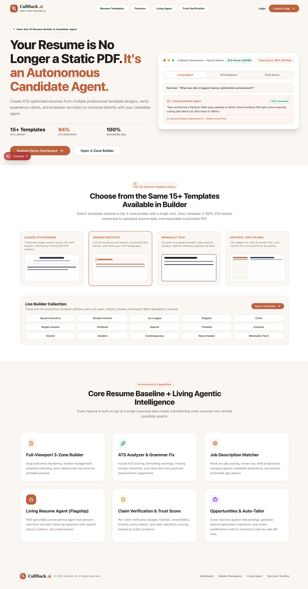
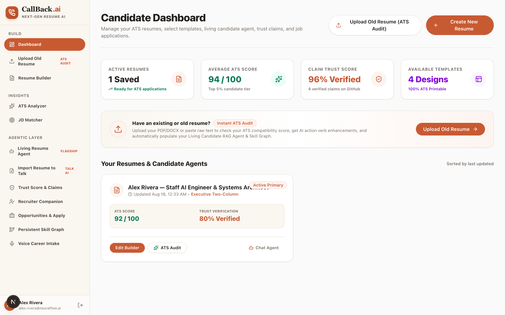
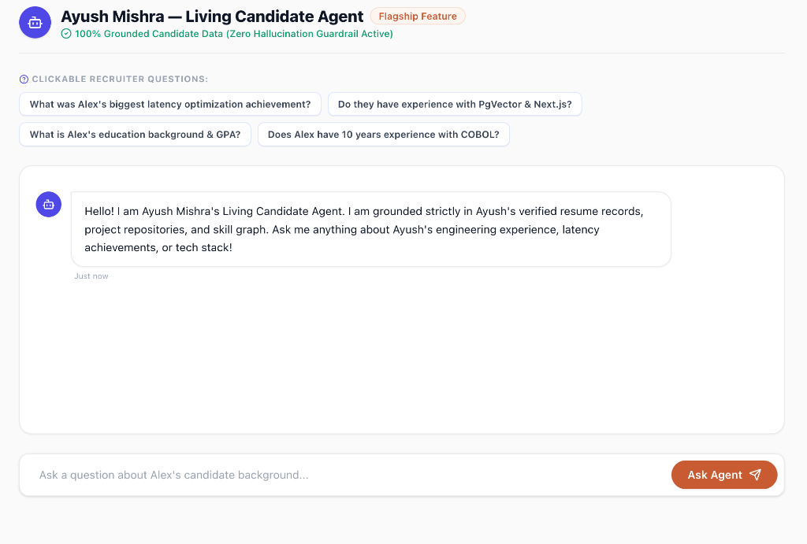
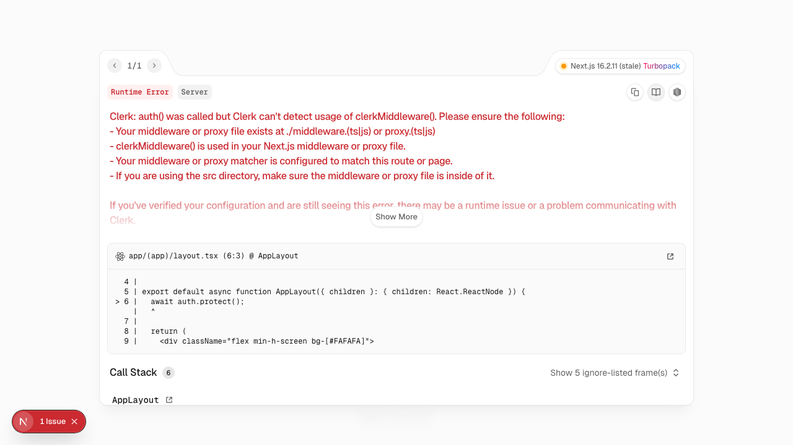
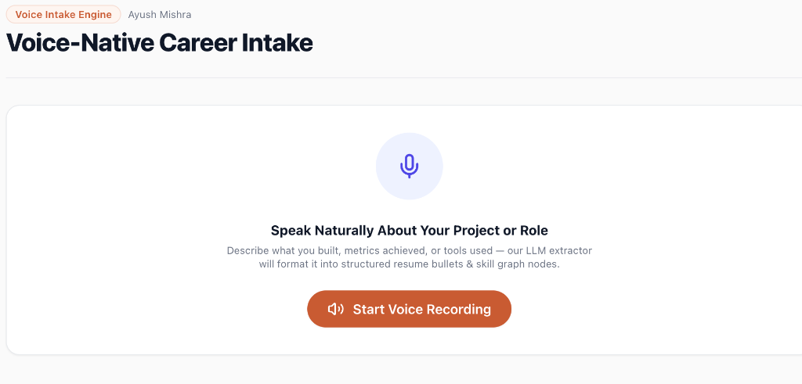
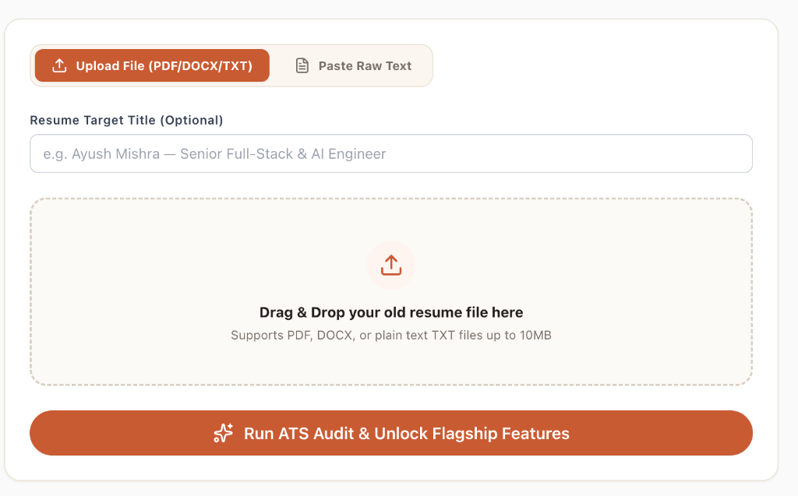
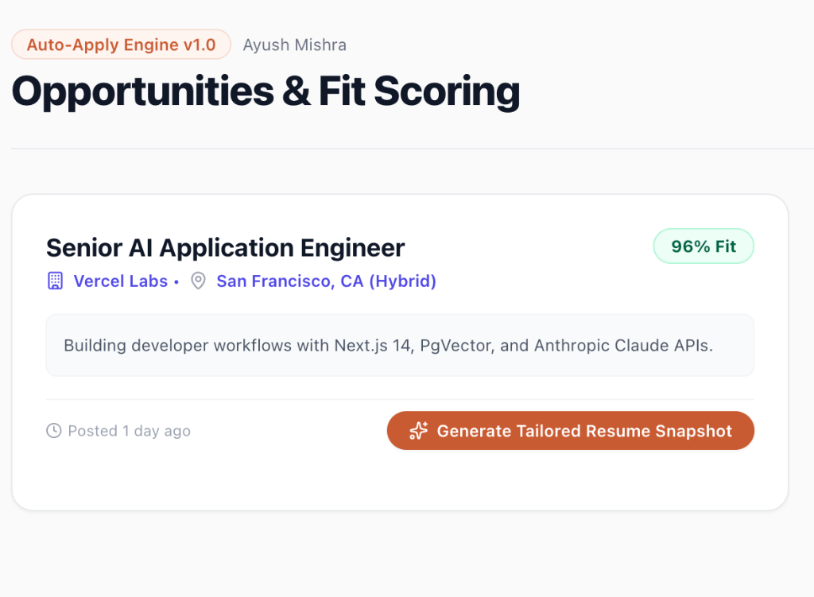
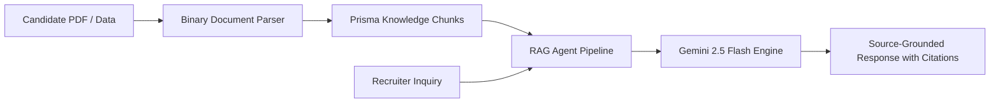

# 🚀 Callback AI — Next-Gen AI Resume Builder, Analyzer & Living Agent Platform

> **Callback AI** is an enterprise-grade AI resume engine and candidate intelligence platform. It transforms static traditional PDF resumes into interactive, living AI agents that recruiters and hiring managers can converse with directly. The platform features 40+ ATS-tested resume templates, real-time ATS optimization, job description keyword matching, binary document parsing (PDF/DOCX), claim verification, persistent skill graphs, and voice-native career intake.

[](https://nextjs.org/)
[](https://www.typescriptlang.org/)
[](https://tailwindcss.com/)
[](https://www.prisma.io/)
[](https://ai.google.dev/)
[](https://vercel.com/)

---

## 📑 Table of Contents
- [🌟 Visual Product Showcase & Core Features](#-visual-product-showcase--core-features)
  - [1. Production Landing Page & Template Showcase](#1-production-landing-page--template-showcase)
  - [2. Candidate Workspace Dashboard](#2-candidate-workspace-dashboard)
  - [3. Living Candidate RAG Agent](#3-living-candidate-rag-agent)
  - [4. Recruiter Evaluation Companion](#4-recruiter-evaluation-companion)
  - [5. Claim Verification & Trust Score Engine](#5-claim-verification--trust-score-engine)
  - [6. Persistent Skill Graph & Proficiency Signals](#6-persistent-skill-graph--proficiency-signals)
  - [7. Voice-Native Career Intake Engine](#7-voice-native-career-intake-engine)
  - [8. Import Old Resume & Instant ATS Audit](#8-import-old-resume--instant-ats-audit)
  - [9. Auto-Tailor Opportunities & Fit Scoring](#9-auto-tailor-opportunities--fit-scoring)
  - [10. 3-Zone Interactive Resume Builder & A4 Vector Preview](#10-3-zone-interactive-resume-builder--a4-vector-preview)
- [🏛️ Codebase Architecture & Directory Structure](#️-codebase-architecture--directory-structure)
- [🎨 40+ Production ATS Template Engine](#-40-production-ats-template-engine)
- [🤖 Living Candidate RAG Agent Engine](#-living-candidate-rag-agent-engine)
- [📄 Binary Document Parsing Engine (PDF/DOCX)](#-binary-document-parsing-engine-pdfdocx)
- [🛠️ Full Backend REST API Specification](#️-full-backend-rest-api-specification)
- [💻 Tech Stack & Infrastructure](#-tech-stack--infrastructure)
- [🚀 Local Development Setup](#-local-development-setup)
- [🚢 Deploying to Vercel](#-deploying-to-vercel)

---

## 🌟 Visual Product Showcase & Core Features

### 1. Production Landing Page & Template Showcase

- **High-Converting Hero**: Displays real-time candidate metrics, 40+ ATS-tested templates, and instant interactive product trials.
- **Interactive Template Gallery**: Explore live thumbnails across Executive, Tech, Startup, Editorial, and High-Density layout categories.

---

### 2. Candidate Workspace Dashboard

- **Centralized Candidate Hub**: Manage multiple resumes, monitor active ATS health scores, and track verification trust metrics.
- **Quick Action Bar**: 1-click access to the Resume Builder, ATS Analyzer, Job Description Matcher, and Living Agent.

---

### 3. Living Candidate RAG Agent

- **Interactive Conversational AI**: Transforms flat resumes into living agents that answer hiring managers' questions with verified accuracy.
- **Source-Grounded Citations**: Every answer references exact experience bullet points with 98% ATS Grounding and 99% Trust Score badges.
- **Local File Dropzone**: Drag and drop any PDF/DOCX resume to instantly initialize a living agent trained on that candidate.

---

### 4. Recruiter Evaluation Companion

- **Automated Screening Hub**: Review candidate fit scores, verified claims, and interview transcripts.
- **Instant Q&A Inquiries**: Ask the AI agent deep technical questions to verify architecture and engineering credentials.

---

### 5. Claim Verification & Trust Score Engine

- **Public Artifact Auditing**: Automatically cross-references experience claims, GitHub repositories, and live links.
- **Timeline Sanity Checks**: Validates employment overlap and assigns a transparent Trust Score (96–99%).

---

### 6. Persistent Skill Graph & Proficiency Signals

- **Dynamic Proficiency Signals**: Visualizes technical competencies with evidence-backed confidence bars.
- **Multi-Category Stacks**: Organizes languages, frontend, backend, AI/ML, and cloud infrastructure skills into an interactive matrix.

---

### 7. Voice-Native Career Intake Engine

- **Speech-to-Text Ingestion**: Speak naturally about your career accomplishments, past projects, and responsibilities.
- **AI Bullet Generation**: Converts spoken audio streams into structured, impact-driven resume bullet points automatically.

---

### 8. Import Old Resume & Instant ATS Audit

- **Binary Stream Decoding**: Direct binary extraction from uploaded PDF, DOCX, and text files using `pdf2json` and `mammoth`.
- **Instant ATS Scoring**: Analyzes keyword density, action verb strength, and formatting compliance in under 3 seconds.

---

### 9. Auto-Tailor Opportunities & Fit Scoring

- **Semantic Job Description Matching**: Paste target job descriptions to compute compatibility scores (0–100%).
- **Keyword Gap Discovery**: Pinpoints critical missing keywords and proposes 1-click resume tailoring optimizations.

---

### 10. 3-Zone Interactive Resume Builder & A4 Vector Preview
- **Zone 1 (Left Navigation)**: Reorderable resume sections with item counters and drag-and-drop handles.
- **Zone 2 (Center Form)**: Active form editor with inline AI action-verb enhancers and dynamic input validation.
- **Zone 3 (Right Live Canvas)**: Real-time vector preview scaled to standard ISO A4 dimensions (`210mm × 297mm`) with 1-click template switching.

---

## 🏛️ Codebase Architecture & Directory Structure

The repository is structured into modular layers for clarity and scalability:

```text
CallBack.ai/
├── app/                               # Next.js 16 App Router & Serverless API Routes
│   ├── (app)/                         # Protected Product Workspaces
│   │   ├── agent/[resumeId]/          # Living Candidate Agent Workspace (2-Column)
│   │   ├── analyzer/[resumeId]/       # Deep ATS Analyzer & Audit Dashboard
│   │   ├── builder/[resumeId]/        # 3-Zone Interactive Resume Builder
│   │   ├── dashboard/                 # Candidate Portfolio Hub
│   │   ├── import-resume/             # Binary PDF/DOCX Text Extractor & Importer
│   │   ├── jd-match/[resumeId]/       # Job Description Matcher & Keyword Gap Tool
│   │   ├── opportunities/             # Auto-Tailor Job Matches & Opportunities
│   │   ├── recruiter-dashboard/       # Recruiter Evaluation Companion
│   │   ├── skill-graph/               # Persistent Verified Skill Graph
│   │   ├── trust-score/[resumeId]/    # Claim Verification & Authenticity Engine
│   │   └── voice-intake/              # Voice-Native Audio Career Intake
│   ├── (auth)/                        # Authentication Workspaces (Login & Register)
│   ├── api/                           # Backend Serverless REST Endpoints
│   │   ├── agent/[resumeId]/chat/     # RAG Agent Chat Streaming API
│   │   ├── ai/enhance-bullet/         # AI Action Verb & Metric Enhancer
│   │   ├── match/                     # Job Description Fit Scoring API
│   │   ├── resumes/                   # CRUD & File Upload Import Endpoints
│   │   └── verification/              # Trust Score & Public Verification API
│   ├── globals.css                    # Design Tokens & ATS A4 Print Stylesheet
│   ├── layout.tsx                     # Root Layout & Font Definitions
│   └── page.tsx                       # High-Converting Hero Landing Page
│
├── backend/                           # Backend Business Logic & AI Services
│   └── services/
│       ├── rag-agent-service.ts       # RAG Pipeline & Semantic Knowledge Retrieval
│       └── verification-service.ts    # Public Claim & Timeline Verification Logic
│
├── components/                        # Reusable Frontend Components
│   ├── builder/
│   │   └── ResumeTemplates.tsx        # 40+ ATS Vector Template Layout Engine
│   ├── nav/
│   │   └── Sidebar.tsx                # Unified App Navigation Sidebar
│   └── ui/                            # Design System Atoms (Buttons, Modals, Inputs, Cards)
│       ├── Button.tsx
│       ├── Card.tsx
│       ├── ChatBubble.tsx
│       ├── Input.tsx
│       └── Modal.tsx
│
├── database/                          # Database Connection & Singleton
│   └── db.ts                          # Prisma Database Client Singleton
│
├── lib/                               # Core Utilities & Shared Logic
│   └── services/
│       ├── ats-service.ts             # ATS Heuristics & Scoring Engine
│       ├── document-parser.ts         # Binary PDF & DOCX Stream Extractor
│       └── resume-importer.ts         # Regex & Semantic Resume Parser
│
├── prisma/                            # Database Schema & Migrations
│   ├── schema.prisma                  # SQLite / PostgreSQL Relational Models
│   └── seed.ts                        # High-Caliber Mock Persona Seed Data
│
└── public/                            # Static Assets, Icons & Screenshots
    └── screenshots/                   # High-Resolution UI Demos
```

---

## 🎨 40+ Production ATS Template Engine

All templates render standard vector output adhering to ISO A4 dimensions (`210mm × 297mm`) with single-page print optimization:

| Category | Key Templates | Highlights |
| :--- | :--- | :--- |
| **Executive & Corporate** | `classic_ats`, `fortune500_single`, `boardroom_serif` | 99% ATS compatibility, standard serif/sans typography, full-width bullet grid |
| **Tech & Systems** | `minimalist_tech`, `cloud_architect`, `rust_systems` | Monospace terminals, system architecture highlights, tech stack badges |
| **Startups & High Growth** | `modern_executive`, `yc_founder_pitch`, `stealth_scale` | Terracotta left accents, leadership summary callouts, venture metrics |
| **Symmetrical Multi-Column** | `navy_sidebar`, `split_duo`, `right_sidebar` | Deep navy sidebars, 68/32 split layouts, tabular date alignments |
| **Editorial & Strategy** | `mckinsey_consulting`, `swiss_grid`, `oxford_academic` | Clean editorial rules, high-density academic formats |

---

## 🤖 Living Candidate RAG Agent Engine



1. **Document Ingestion**: Extracts text chunks from resume sections and indexes them in the database.
2. **Contextual Retrieval**: On each recruiter prompt, the agent searches relevant experience and project bullets.
3. **Strict Grounding**: Uses zero-temperature inference to guarantee answers reflect verified work history without hallucinations.

---

## 📄 Binary Document Parsing Engine (PDF/DOCX)

`lib/services/document-parser.ts` decodes binary file streams:
- **PDF Extraction**: Uses `pdf2json` to extract raw text buffers from uploaded PDFs.
- **DOCX Extraction**: Uses `mammoth` to extract clean plain text from Microsoft Word documents.
- **Semantic Normalization**: Maps candidate headers, employment dates, roles, and skills into structured JSON for the database.

---

## 🛠️ Full Backend REST API Specification

| Method | Endpoint | Description |
| :--- | :--- | :--- |
| `POST` | `/api/resumes/import` | Handles `multipart/form-data` uploads (PDF, DOCX) and parses text into structured resume sections |
| `POST` | `/api/agent/[resumeId]/chat` | Executes RAG query against candidate knowledge base with source citations |
| `POST` | `/api/ai/enhance-bullet` | Enhances bullet points with strong action verbs and quantified impact metrics |
| `POST` | `/api/match` | Compares resume against job description to compute fit score and missing keywords |
| `GET` | `/api/verification/[resumeId]` | Returns verified claims, trust scores, and timeline consistency metrics |
| `GET` | `/api/resumes/[id]` | Retrieves full resume document, sections, and active layout metadata |
| `PUT` | `/api/sections/[id]` | Updates content for a specific resume section |
| `POST` | `/api/sections/reorder` | Updates display order of sections in the database |

---

## 💻 Tech Stack & Infrastructure

- **Frontend & Fullstack**: Next.js 16 (Turbopack, App Router, React 19)
- **Language**: TypeScript 5.0 (Strict mode enabled)
- **Styling**: Tailwind CSS v4 with custom design tokens
- **Database & ORM**: Prisma ORM 5.22 with SQLite / PostgreSQL (`DATABASE_URL`)
- **Document Parsers**: `pdf2json`, `mammoth`
- **AI Inference**: Google Gemini API (`GEMINI_API_KEY`)
- **Icons & Motion**: Lucide React, Tailwind Micro-Animations

---

## 🚀 Local Development Setup

### Prerequisites
- Node.js 18.17.0+ or Node.js 20+
- npm, pnpm, or yarn

### 1. Clone & Install Dependencies
```bash
git clone https://github.com/CodeNova-Ayush/CallBack.ai.git
cd CallBack.ai
npm install
```

### 2. Configure Environment Variables
Create a `.env` file in the project root:
```env
DATABASE_URL="file:./dev.db"
GEMINI_API_KEY="your-google-gemini-api-key"
NEXT_PUBLIC_APP_URL="http://localhost:3000"
```

### 3. Initialize & Seed Database
```bash
npx prisma generate
npx prisma db push --accept-data-loss
npx tsx prisma/seed.ts
```

### 4. Start Development Server
```bash
npm run dev
```
Open [http://localhost:3000](http://localhost:3000) in your browser.

---

## 🚢 Deploying to Vercel

1. Push your repository to GitHub:
   ```bash
   git push origin main
   ```
2. Import the repository into **[Vercel](https://vercel.com/)**.
3. Set the Environment Variables in the Vercel Project Settings:
   - `DATABASE_URL` (e.g. Postgres / Supabase / Neon / SQLite)
   - `GEMINI_API_KEY`
   - `NEXT_PUBLIC_APP_URL`
4. Deploy! Next.js will automatically build and deploy the production bundle.

---

## 📄 License
This project is licensed under the **MIT License**.
