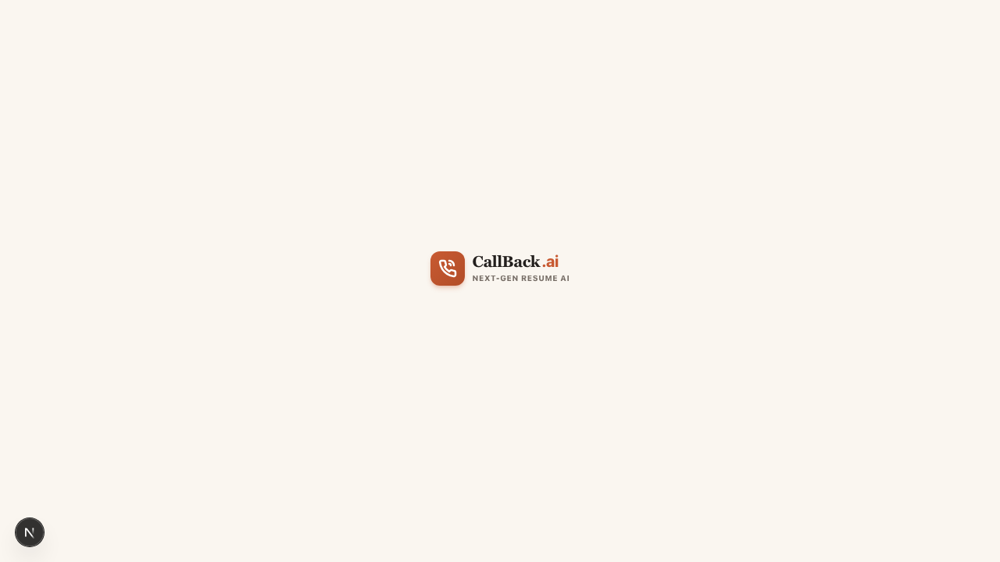
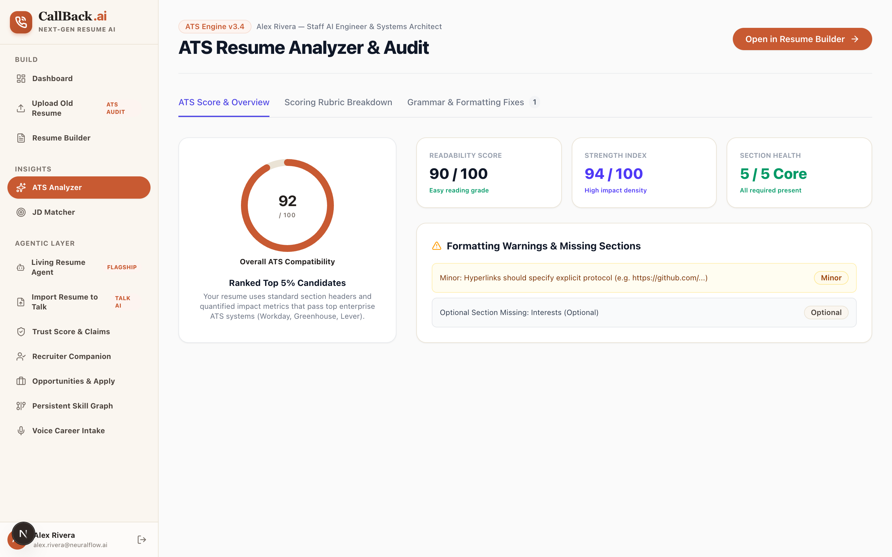
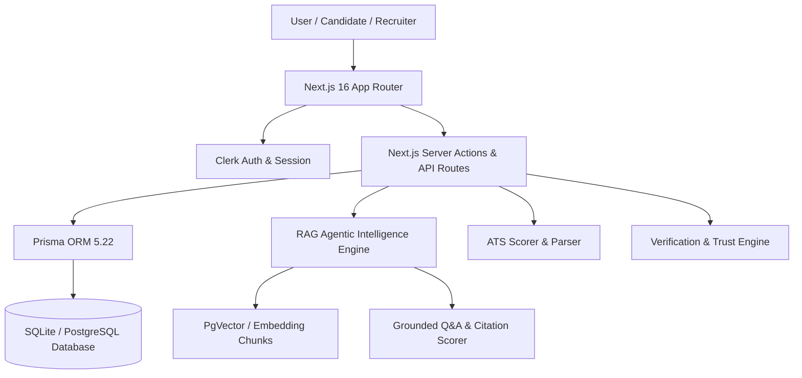

# Callback AI — Autonomous Living Candidate Agent & Next-Gen Resume System

> **Transforming static candidate resumes into RAG-grounded, claim-verified, living AI candidate agents.**

[](https://nextjs.org/)
[](https://www.typescriptlang.org/)
[](https://tailwindcss.com/)
[](https://www.prisma.io/)
[](https://clerk.com/)

---

## 🌟 Executive Overview

**CallBack.ai** is a YC-stage candidate platform and autonomous agent system. Instead of sending static PDF resumes to black-hole ATS parsers, Callback.ai converts every resume into a living digital candidate asset.

Recruiters and hiring managers can converse directly with your **Living Candidate Agent** — asking deep technical questions (*"What was Alex's biggest latency optimization achievement?"*, *"Show experience with Next.js & PgVector"*) and receiving 100% grounded responses with explicit source citations and zero hallucination.

---

## 📷 High-Resolution Showcase & Feature Gallery

### 1. Production Landing Page

*Interactive landing page featuring full template gallery showcase, feature breakdown, live agent preview tab, and quick trial launchpad.*

---

### 2. Candidate Workspace Dashboard

*Central candidate dashboard displaying active resumes, average ATS score (94/100), claim trust verification (96% verified), template selection, and 1-click ATS audit launcher.*

---

### 3. Full-Viewport 3-Zone Resume Builder & Multi-Template Engine

*Drag-and-drop section ordering, real-time A4 printable preview, template switching (Modern Executive, Classic ATS, Minimalist Tech, Midnight Navy Sidebar), and metric bullet enhancement.*

---

### 4. Living Candidate RAG Agent (Flagship Feature)

*Conversational agent backed by vector embeddings and strict RAG grounding. Answers recruiter queries with explicit source citations and anti-hallucination guardrails.*

---

### 5. ATS Analyzer & Grammar Improvement Engine

*Instant ATS compatibility scoring, parser formatting checklist, readability index, and inline 1-click action verb & metric phrasing suggestions.*

---

### 6. Recruiter Companion & Candidate Evaluation Surface

*Recruiter-facing workspace allowing hiring teams to evaluate candidates, run instant technical Q&A, review verification claims, and schedule interviews.*

---

### 7. Claim Verification & Trust Score Engine

*Per-claim verification badges (Verified, Unverifiable, Inconsistent), timeline sanity checks, and public evidence linking (e.g. GitHub repos, degree records).*

---

### 8. Persistent Skill Graph

*Interlinked skill entity network mapping technical skills, proficiency signals, and supporting resume evidence.*

---

### 9. Voice-Native Career Intake

*Voice speech parsing that transcribes spoken career stories into structured resume sections and skill node data.*

---

### 10. Auto-Tailor Opportunities & Application Snapshots

*Match resumes against live job postings, generate custom application snapshots, and review modifications in a side-by-side diff viewer.*

---

## 🏗️ System Architecture



---

## 💻 Tech Stack Specification

| Component | Technology | Version / Notes |
| :--- | :--- | :--- |
| **Framework** | Next.js App Router | `16.2.11` with Turbopack |
| **Language** | TypeScript | `5.0` (Strict Mode) |
| **Styling** | Tailwind CSS | `v4.0` with Warm Ivory (`#FAF6F0`) & Terracotta (`#C85A32`) |
| **Icons** | Lucide React | `lucide-react` vector set |
| **ORM** | Prisma ORM | `5.22.0` |
| **Database** | SQLite | `dev.db` (compatible with PostgreSQL) |
| **Auth** | Clerk SDK | `@clerk/nextjs` |
| **Animation** | Framer Motion & Confetti | `framer-motion`, `canvas-confetti` |
| **PDF Engine** | Native CSS `@media print` | Responsive printable A4 renderer |

---

## 🚀 Quick Start & Local Setup

### Prerequisites
- Node.js `>= 18.0.0`
- npm `>= 9.0.0`

### 1. Clone & Install
```bash
git clone https://github.com/CodeNova-Ayush/CallBack.ai.git
cd CallBack.ai
npm install
```

### 2. Prepare & Seed Database
```bash
npx prisma generate
npx prisma db push --accept-data-loss
npx tsx prisma/seed.ts
```

### 3. Launch Development Server
```bash
npm run dev
```

Visit [http://localhost:3000](http://localhost:3000) to view the live app.

---

## 📜 Available Scripts

- `npm run dev` — Launch Next.js dev server on `http://localhost:3000`
- `npm run build` — Sync Prisma schema, seed database, and compile production bundle
- `npm run start` — Run production server
- `npm run lint` — Execute ESLint syntax check
- `npx tsx prisma/seed.ts` — Re-seed database with realistic candidate & recruiter demo data

---

## 📄 License & Attribution

© 2026 Callback AI. All rights reserved. Built with Next.js 16, TypeScript, Tailwind CSS, and Prisma ORM.
