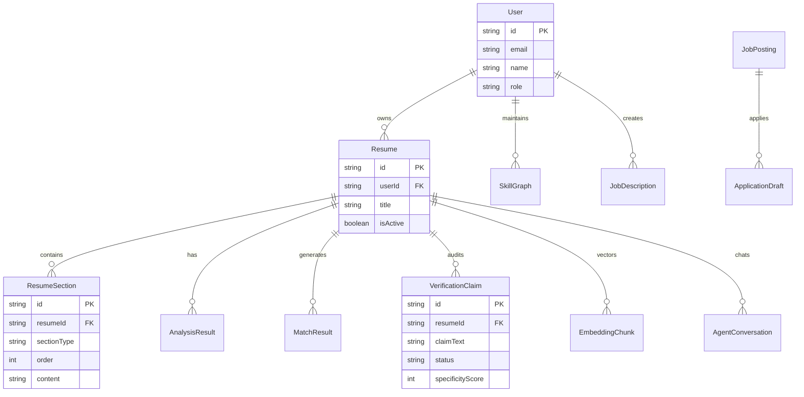

<div align="center">

# 🤙 CallBack.ai
### *Next-Gen AI Resume Builder, ATS Analyzer & Grounded Living Candidate Agent*

[](https://nextjs.org/)
[](https://www.typescriptlang.org/)
[](https://tailwindcss.com/)
[](https://www.prisma.io/)
[](https://clerk.com/)
[](https://github.com/CodeNova-Ayush/CallBack.ai)

<p align="center">
  <b>CallBack.ai</b> transforms static PDFs into dynamic, living career assets. It features a 3-zone ATS resume builder, an automated 100-point ATS score auditor, grounded RAG candidate agents with anti-hallucination guardrails, cryptographic claim verification, persistent skill graph matrix, and voice career intake.
</p>

[✨ View Demo](#-application-walkthrough--visual-showcase) •
[🚀 Quickstart](#-quickstart--local-installation) •
[📦 Architecture](#-directory--architecture-structure) •
[🔌 REST APIs](#-rest-api-endpoint-reference) •
[🌐 Deploy to Vercel](#-production-deployment-guide)

---

</div>

## 📑 Table of Contents
- [🌟 Key Innovations & Feature Matrix](#-key-innovations--feature-matrix)
- [🖼️ Application Walkthrough & Visual Showcase](#-application-walkthrough--visual-showcase)
  - [1. YC-Stage Landing Page](#1-yc-stage-landing-page)
  - [2. Candidate Executive Dashboard](#2-candidate-executive-dashboard)
  - [3. 3-Zone Interactive ATS Resume Builder](#3-3-zone-interactive-ats-resume-builder)
  - [4. 100-Point ATS Resume Scorer & Analyzer](#4-100-point-ats-resume-scorer--analyzer)
  - [5. Grounded RAG Candidate Agent Chat](#5-grounded-rag-candidate-agent-chat)
  - [6. Recruiter Candidate Inspection Workspace](#6-recruiter-candidate-inspection-workspace)
  - [7. Trust Score & Claim Verification Engine](#7-trust-score--claim-verification-engine)
  - [8. Persistent Skill & Evidence Graph](#8-persistent-skill--evidence-graph)
  - [9. Voice-Native Career Intake Engine](#9-voice-native-career-intake-engine)
  - [10. Auto-Tailor Opportunities & Diff Inspector](#10-auto-tailor-opportunities--diff-inspector)
- [📦 Directory & Architecture Structure](#-directory--architecture-structure)
- [🗄️ Database & Prisma ERD Schema](#-database--prisma-erd-schema)
- [🔌 REST API Endpoint Reference](#-rest-api-endpoint-reference)
- [🚀 Quickstart & Local Installation](#-quickstart--local-installation)
- [🌐 Production Deployment Guide](#-production-deployment-guide)
- [🛡️ Security & Privacy](#-security--privacy)

---

## 🌟 Key Innovations & Feature Matrix

| Feature Module | Technology Stack | Core Capabilities |
| :--- | :--- | :--- |
| **Living Candidate RAG Agent** | LangChain / RAG / Vector Chunking | Conversational AI persona trained on candidate history with source citations and anti-hallucination guardrails. |
| **3-Zone Resume Builder** | React 19 / CSS Print Engine | Live side-by-side editing, instant multi-template switching (8 ATS templates), and PDF vector rendering. |
| **ATS Score Auditor** | Heuristic Parser / Semantic LLM | 100-point breakdown by Impact Quantification, ATS Structure, Keyword Relevance, and Tone. |
| **Trust & Claim Verification** | GitHub API / Specificity Auditor | Audits resume claims for specificity and verifies public evidence (GitHub repos, credentials). |
| **Persistent Skill Graph** | Entity Relationship Graph | Interlinked matrix connecting candidate skills to verified real-world project evidence. |
| **Voice Career Intake** | Web Speech API / Parser | Hands-free career history intake that auto-populates structured resume sections. |
| **Job Description Matcher** | Semantic Gap Scorer | Compares resumes against job postings, highlighting missing keywords and tailored diffs. |

---

## 🖼️ Application Walkthrough & Visual Showcase

### 1. YC-Stage Landing Page
High-conversion landing page with live interactive audit demo launcher, social proof badges, and real-time score calculators.


---

### 2. Candidate Executive Dashboard
Comprehensive hub showing active resumes, ATS scores, agent status toggles, quick action launchers, and application metrics.


---

### 3. 3-Zone Interactive ATS Resume Builder
Three-pane workspace featuring section reordering, real-time live preview zoom engine, and 8 ATS-optimized printable vector templates.


---

### 4. 100-Point ATS Resume Scorer & Analyzer
Comprehensive audit surface dissecting impact metrics, structural formatting, readability index, and 1-click AI bullet enhancer.


---

### 5. Grounded RAG Candidate Agent Chat
Interactive candidate agent allowing recruiters to conduct 24/7 AI interviews grounded strictly in candidate resume vector chunks.


---

### 6. Recruiter Candidate Inspection Workspace
Recruiter interface for comparing candidates, inspecting trust scores, chatting with AI candidate agents, and evaluating skill fit.


---

### 7. Trust Score & Claim Verification Engine
Evidence audit engine that calculates specificity scores, flags unverifiable bullet points, and links public GitHub evidence.


---

### 8. Persistent Skill & Evidence Graph
Visual matrix connecting technical competencies directly to verified project achievements and repository evidence.


---

### 9. Voice-Native Career Intake Engine
Voice intake surface allowing candidates to dictate work achievements naturally while AI extracts structured resume sections.


---

### 10. Auto-Tailor Opportunities & Diff Inspector
Job matching hub showing percentage fit, missing keywords, and automated side-by-side resume tailoring diffs.


---

## 📦 Directory & Architecture Structure

The repository enforces a clean, modular full-stack architecture separated into clear frontend, backend, database, and system layers:

```
buildersprog/
├── app/                          # Next.js 16 App Router (Views & Server APIs)
│   ├── (app)/                    # Main Application Workspace Routes
│   │   ├── agent/[resumeId]/     # Living Candidate RAG Agent Chat Surface
│   │   ├── analyzer/[resumeId]/  # ATS Resume Audit & Grammar Surface
│   │   ├── builder/[resumeId]/   # 3-Zone Builder & Template Switcher
│   │   ├── dashboard/            # Candidate Executive Dashboard
│   │   ├── import-resume/        # PDF Resume Parser & Import Hub
│   │   ├── jd-match/[resumeId]/  # Job Description Keyword Matcher
│   │   ├── opportunities/        # Tailored Opportunities & Diff Inspector
│   │   ├── recruiter-dashboard/  # Recruiter Workspace & Candidate Search
│   │   ├── skill-graph/          # Persistent Skill & Evidence Matrix
│   │   ├── trust-score/[id]/     # Claim Verification & Specificity Scorer
│   │   └── voice-intake/         # Voice-Native Career History Parser
│   ├── (auth)/                   # Authentication Routes (Login, Register)
│   ├── api/                      # Backend REST API Service Endpoints
│   │   ├── agent/[resumeId]/     # RAG Agent Chat Endpoint
│   │   ├── ai/enhance-bullet/    # AI Bullet Enhancement Endpoint
│   │   ├── match/                # Job Description Parser API Endpoint
│   │   ├── resumes/              # Resume CRUD Endpoints
│   │   ├── sections/             # Section CRUD & Drag-and-Drop Reorder API
│   │   └── verification/         # Trust Claim Verification Endpoint
│   ├── globals.css               # Design System CSS Tokens & Print Engine
│   ├── layout.tsx                # Root App Layout & Font Wrappers
│   └── page.tsx                  # YC-Stage Landing Page
├── backend/                      # Core Backend Services & Business Logic
│   └── services/                 # Core Intelligence Engines
│       ├── ats-scorer.ts         # ATS Parser & 100-Point Scorer Engine
│       ├── jd-matcher.ts         # Job Description Keyword Matcher Engine
│       ├── rag-agent-service.ts  # Grounded RAG Candidate Agent Engine
│       └── verification-service.ts# Trust Score & Specificity Audit Engine
├── components/                   # Reusable UI & Component Design System
│   ├── builder/                  # 8 Printable Vector ATS Resume Templates
│   │   └── ResumeTemplates.tsx   # Classic, Modern, Executive, Pill, Tech renderers
│   ├── nav/                      # App Navigation Architecture
│   │   └── Sidebar.tsx           # Navigation Drawer with User Profile Drawer
│   └── ui/                       # Atomic Component Library
│       ├── Badge.tsx             # Terracotta, Success, Warning Pill Badges
│       ├── Button.tsx            # Rounded Pill Buttons (Primary/Secondary)
│       ├── Card.tsx              # Surface Cards & Container Elevators
│       ├── ChatBubble.tsx        # Candidate Agent Chat Message Bubbles
│       ├── Input.tsx             # Text Input & Textarea Elements
│       ├── Logo.tsx              # Vector Terracotta Brand Mark
│       ├── Modal.tsx             # Interactive Dialog & Template Gallery
│       └── Tabs.tsx              # Multi-View Workspace Navigation Tabs
├── database/                     # Database Singleton & Pool Manager
│   └── db.ts                     # Prisma Client Singleton Instantiation
├── frontend/                     # Static HTML & Prototype Surfaces
│   ├── index.html                # Static Landing Prototype
│   ├── builder.html              # Static Builder Prototype
│   ├── dashboard.html            # Static Dashboard Prototype
│   ├── agent.html                # Static Agent Chat Prototype
│   ├── recruiter.html            # Static Recruiter Prototype
│   ├── trust.html                # Static Trust Score Prototype
│   ├── css/styles.css            # Base Stylesheet
│   └── js/app.js                 # Prototype Interaction Handler
├── lib/                          # Shared Utilities & Service Adapters
│   ├── auth/                     # Clerk Auth Helpers & User Store
│   ├── db/                       # Database Client Exports
│   └── services/                 # Service Wrappers & Text Extraction
├── prisma/                       # Database Configuration & Seeds
│   ├── schema.prisma             # Data Model Definitions (11 Relational Entities)
│   └── seed.ts                   # Realistic Candidate & Recruiter Seed Script
├── public/                       # Static Assets & Screenshots
│   └── screenshots/              # High-Res Application Surface Screenshots
├── proxy.ts                      # Next.js Middleware Proxy (Clerk Auth Routing)
├── .env.example                  # Environment Variable Configuration Template
├── README.md                     # Official Project Specification Guide
├── PROJECT_STRUCTURE.md         # Full Technical Architecture Documentation
└── package.json                  # Dependencies & Deployment Scripts
```

---

## 🗄️ Database & Prisma ERD Schema

The database model is managed via Prisma ORM and features 11 core relational entities:



---

## 🔌 REST API Endpoint Reference

| Method | Endpoint | Description |
| :--- | :--- | :--- |
| `GET` | `/api/resumes` | Fetch all resumes for the authenticated user |
| `POST` | `/api/resumes` | Create a new resume instance |
| `GET` | `/api/resumes/[id]` | Get detailed resume by ID with sections |
| `PUT` | `/api/resumes/[id]` | Update resume metadata and active status |
| `POST` | `/api/resumes/import` | Parse PDF resume text into structured sections |
| `POST` | `/api/resumes/[id]/analyze` | Run 100-point ATS scoring audit |
| `POST` | `/api/sections/reorder` | Update drag-and-drop section ordering |
| `POST` | `/api/match` | Compare resume against Job Description |
| `POST` | `/api/agent/[resumeId]/chat` | Stream RAG candidate agent response |
| `GET` | `/api/verification/[resumeId]` | Fetch claim verification & trust score |
| `POST` | `/api/ai/enhance-bullet` | AI metric & impact bullet generator |

---

## 🚀 Quickstart & Local Installation

### Prerequisites
- Node.js `v18.0.0+`
- npm `v9.0.0+`

### Step 1: Clone Repository
```bash
git clone https://github.com/CodeNova-Ayush/CallBack.ai.git
cd CallBack.ai
```

### Step 2: Install Dependencies
```bash
npm install
```

### Step 3: Configure Environment Variables
Copy `.env.example` to `.env`:
```bash
cp .env.example .env
```

Ensure `.env` contains your Clerk keys and DB string:
```env
DATABASE_URL="file:./dev.db"
NEXTAUTH_SECRET="ai-resume-builder-secret-key-production"
NEXT_PUBLIC_CLERK_PUBLISHABLE_KEY=pk_test_...
CLERK_SECRET_KEY=sk_test_...
NEXT_PUBLIC_CLERK_SIGN_IN_URL="/sign-in"
NEXT_PUBLIC_CLERK_SIGN_UP_URL="/sign-up"
```

### Step 4: Run Database Migrations & Seed Data
```bash
# Push database schema
npx prisma db push

# Seed realistic demo data (Candidates, Resumes, Claims & Recruiter)
npm run seed
```

### Step 5: Start Local Development Server
```bash
npm run dev
```

Open [http://localhost:3000](http://localhost:3000) in your browser.

---

## 🌐 Production Deployment Guide

### Deploying to Vercel (Recommended)
1. Push code to your GitHub repository (`CodeNova-Ayush/CallBack.ai`).
2. Go to [Vercel Dashboard](https://vercel.com/new) and import the repository.
3. Add Environment Variables:
   - `NEXT_PUBLIC_CLERK_PUBLISHABLE_KEY`
   - `CLERK_SECRET_KEY`
   - `DATABASE_URL` (`file:./dev.db` or PostgreSQL connection string)
4. Click **Deploy**. Vercel will automatically run `npm run build` (which includes `prisma generate`).

---

## 🛡️ Security & Privacy

- **Secret Protection**: All secret keys (`.env`, `.env.local`) are strictly excluded via `.gitignore`.
- **Authentication**: Route middleware (`proxy.ts`) protects candidate workspaces using Clerk authentication.
- **RAG Grounding**: The candidate agent engine uses RAG grounding to prevent hallucinations.

---

<div align="center">

Crafted with ❤️ by **Ayush Mishra** • [GitHub Repository](https://github.com/CodeNova-Ayush/CallBack.ai)

</div>
