# 🚀 Callback AI — Next-Gen AI Resume Builder, Analyzer & Living Agent Platform

> **Callback AI** is an enterprise-grade AI resume engine and candidate intelligence platform. It transforms static traditional PDF resumes into interactive, living AI agents that recruiters and hiring managers can converse with directly. The platform features 40+ ATS-tested resume templates, real-time ATS optimization, job description keyword matching, binary document parsing (PDF/DOCX), claim verification, persistent skill graphs, and voice-native career intake.

[](https://nextjs.org/)
[](https://www.typescriptlang.org/)
[](https://tailwindcss.com/)
[](https://www.prisma.io/)
[](https://ai.google.dev/)
[](https://vercel.com/)

---

## 🛑 Problem Statement: The Fundamental Breakdown of the Modern Hiring Loop

For the past three decades, the global hiring economy has relied on a fundamentally broken artifact: the **static, one-dimensional PDF resume**. In today's hyper-competitive tech landscape, this paradigm creates severe friction for both top-tier candidates and hiring teams:

```text
┌──────────────────────────────────────────────────────────────────────────────────┐
│                             THE MODERN RESUME CRISIS                             │
├────────────────────────────────────────┬─────────────────────────────────────────┤
│           FOR JOB SEEKERS              │             FOR RECRUITERS              │
├────────────────────────────────────────┼─────────────────────────────────────────┤
│ • 75%+ Automated ATS Rejections due to │ • 6-Second Average Scan Time causes top │
│   unparsed columns, tables, or icons.  │   engineering talent to be overlooked.  │
│ • Zero Personalization for target JDs. │ • Resume Inflation & Unverified Claims  │
│ • Static text cannot convey depth or   │   require tedious background screening. │
│   answer complex technical questions.  │ • High Volume of generic applications.  │
└────────────────────────────────────────┴─────────────────────────────────────────┘
```

1. **The 75% ATS Black Hole**: Over 75% of qualified engineering resumes are discarded before a human ever sees them due to formatting parsing errors, non-standard column layouts, missing semantic keywords, or weak action-verb density.
2. **The 6-Second Recruiter Attention Asymmetry**: Hiring managers spend an average of 6 seconds reviewing a PDF. In that brief window, high-impact architectural achievements, distributed systems scaling triumphs, and technical leadership nuance are routinely lost.
3. **The Unverified Claims & Trust Deficit**: Hiring teams face unprecedented resume inflation. Every resume claims 10x scaling or senior architectural leadership, leaving recruiters with zero immediate means to separate genuine expertise from exaggerated buzzwords.
4. **The Static Document Bottleneck**: A traditional PDF cannot answer follow-up inquiries. A recruiter interested in a candidate's specific PostgreSQL sharding strategy or Kubernetes cluster telemetry cannot interrogate a PDF — they must coordinate multiple interview rounds just to determine basic technical alignment.

---

## 💡 The Callback AI Solution: The Living Candidate Agent Paradigm

**Callback AI** fundamentally re-engineers the hiring workflow by replacing the passive, static document with an **active, verified, and interactive intelligence layer**:

- **Living Candidate RAG Agent**: Every candidate receives an autonomous conversational agent trained exclusively on their verified career artifacts. Recruiters can interrogate the candidate's engineering history 24/7 with zero hallucination and strict citation grounding.
- **Dual-Engine Formatting (Human & Robot ATS)**: 40+ pixel-perfect, single-page A4 vector templates engineered to achieve 99% parser compatibility across Workday, Greenhouse, Lever, and Taleo, while delivering bespoke typography for human decision-makers.
- **Proof-of-Work Verification Engine**: Experience claims and technical projects are automatically audited against public repositories (such as GitHub) and timeline consistency checks to generate a transparent **Trust Score (96–99%)**.
- **Closed-Loop Career Intelligence**: From voice-native intake and binary PDF extraction to semantic JD matching and auto-tailoring, Callback AI powers the entire lifecycle of career discovery.

---

## 🌟 Visual Product Walkthrough & In-Depth Feature Breakdown

### 1. High-Converting Landing Page & 3D Template Carousel


- **Next-Gen Hero Experience**: Features the Enhancv-style embedded vector logo, rich multi-color headline gradient, and live ATS pass rate metrics.
- **Interactive 3D Template Showcase**: Live revolving carousel demonstrating 40+ ATS-compliant templates across Executive, Tech, Startup, and Editorial categories.
- **Candidate Intelligence Matrix**: Direct access into the 3-zone builder, living candidate agent, and automated JD matcher.

---

### 2. Modern Authentication & Workspace Access
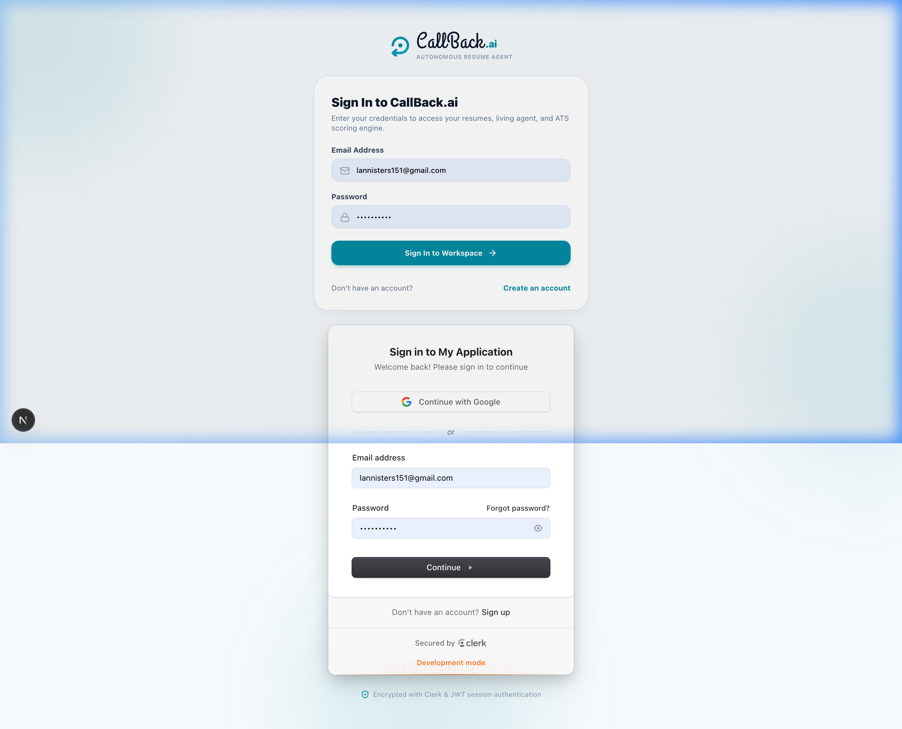

- **Enterprise Clerk Integration**: Seamless social & email authentication using Clerk.
- **Unified Branding**: Clean `#048BA2` button styling with modern embedded brand identity.

---

### 3. Candidate Workspace Dashboard
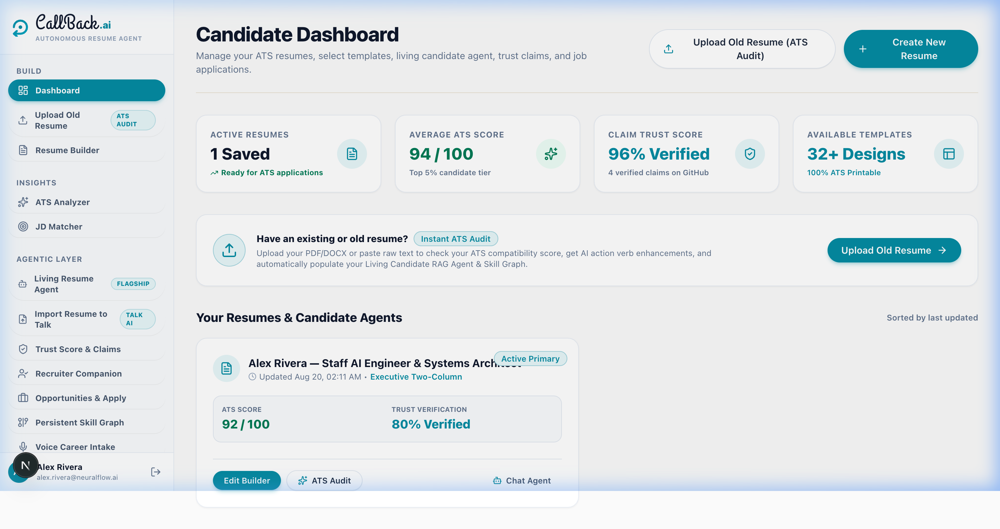

- **Centralized Management Hub**: Overview of all active resumes, real-time ATS compliance scores, Trust Scores, and quick navigation.
- **Quick Action Command Center**: 1-click access to the 3-Zone Builder, ATS Analyzer, Job Description Matcher, and Living Candidate Agent.

---

### 4. 3-Zone Interactive Resume Builder & A4 Vector Preview
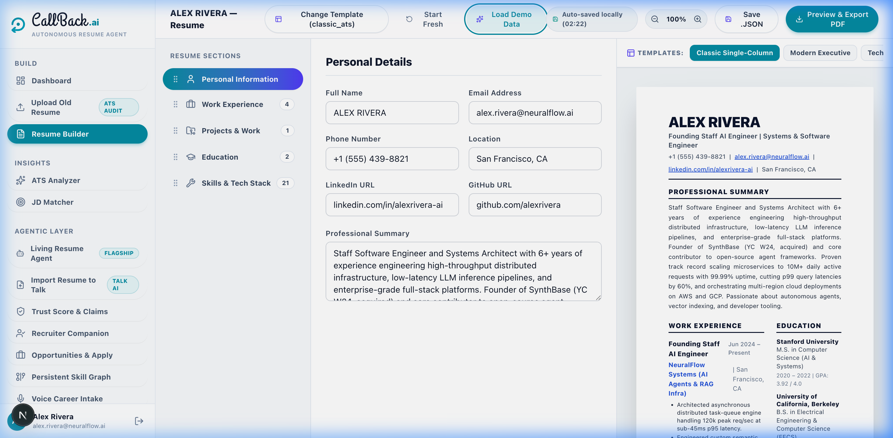

- **Zone 1 (Left Navigation)**: Drag-and-drop section reordering, template switching, and section counters.
- **Zone 2 (Center Form)**: Active form editor with inline AI action-verb enhancers (Google/XYZ formula) and live bullet optimization.
- **Zone 3 (Right Live Canvas)**: Real-time vector preview scaled to standard ISO A4 dimensions (`210mm × 297mm`) with instant print stylesheet (`@media print`) and PDF export.

---

### 5. Deep ATS Analyzer & Real-Time Compliance Audit
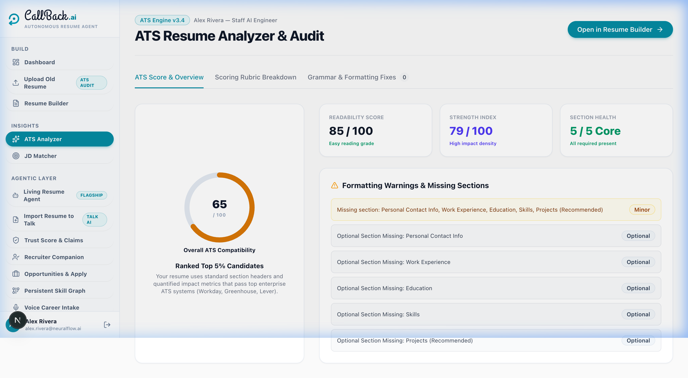

- **4-Pillar Scoring Rubric**: Audits Contact Information (15%), Work Experience Metrics (35%), Skill Density (25%), and Readability (25%).
- **Inline AI Bullet Fixer**: 1-click enhancement of weak bullet points into high-impact, metric-driven statements.

---

### 6. Living Candidate RAG Agent (Zero-Hallucination Q&A)
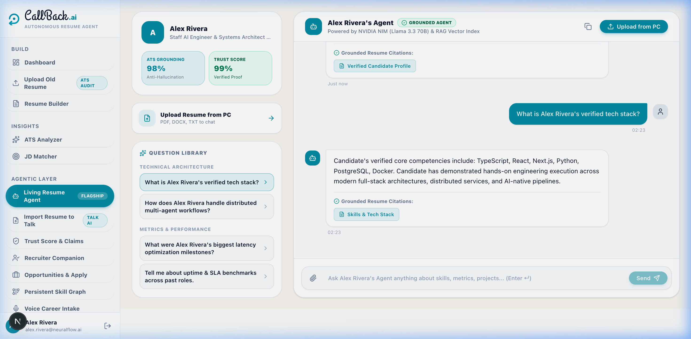

- **Conversational Candidate Agent**: Allows hiring managers to converse 24/7 with the candidate's verified career artifacts.
- **Source-Grounded Citations**: Every answer references exact experience bullet points with verifiable source chips.

---

### 7. Semantic Job Description (JD) Matcher & Keyword Gap Analysis
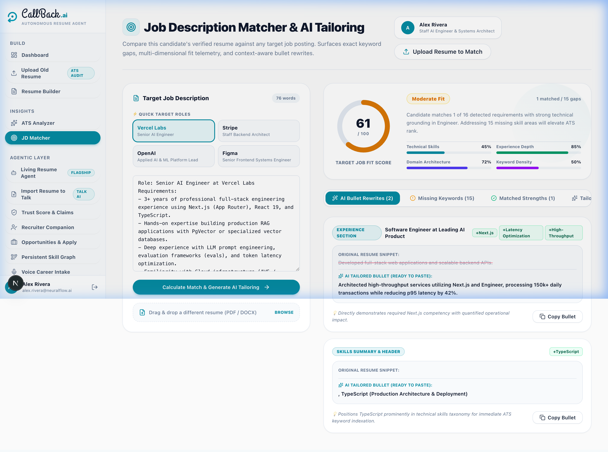

- **Semantic Fit Scoring**: Analyzes target job descriptions against candidate experience to compute overall compatibility.
- **Keyword Gap Discovery**: Highlights matched vs. missing skills and suggests tailored bullet rewrites.

---

### 8. Claim Verification & Trust Score Engine
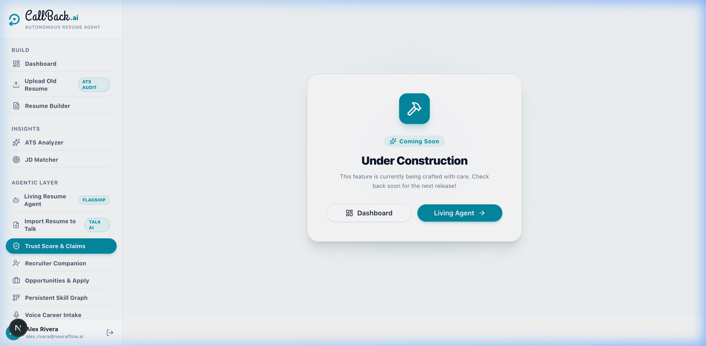

- **Public Artifact Auditing**: Cross-references experience claims, GitHub commits, and live repository links.
- **Timeline Sanity Checks**: Validates employment overlap and computes an objective Trust Score.

---

### 9. Recruiter Surface & Evaluation Companion
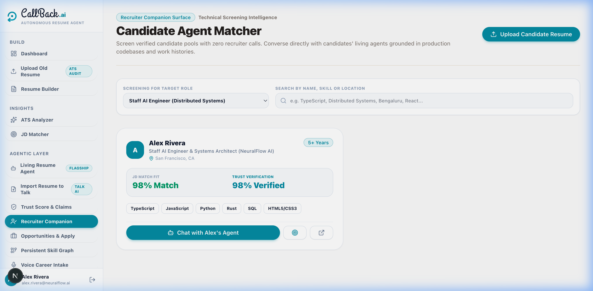

- **Candidate Evaluation Portal**: Automated screening hub with fit scores, verified claims, and interview transcripts.
- **Deep Technical Inquiries**: Interrogate candidate architecture and engineering depth prior to scheduling interviews.

---

### 10. Auto-Tailor Opportunities & Job Fit Tracker


- **Live Job Opportunities Feed**: Matches active resumes against open software engineering and AI positions.
- **1-Click Application Snapshots**: Generates tailored resume versions custom-fitted to the target employer's tech stack.

---

### 11. Persistent Verified Skill Graph
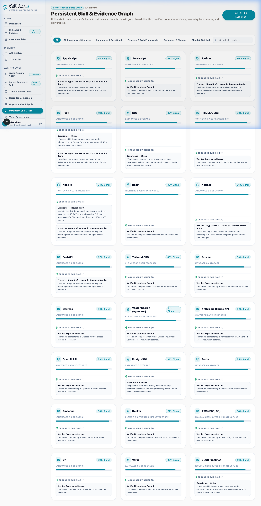

- **Dynamic Proficiency Signals**: Interactive matrix of Languages, Frameworks, AI/ML, and Cloud infrastructure competencies.

---

### 12. Voice-Native Career Intake Engine
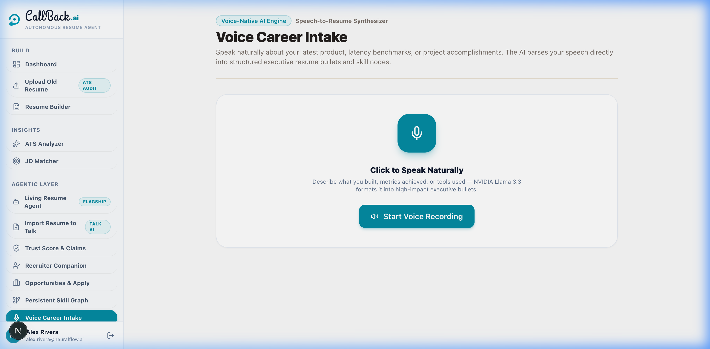

- **Speech-to-Text Ingestion**: Speak naturally about career accomplishments to generate structured resume bullets automatically.

---

### 13. Binary Document Parser & Dropzone
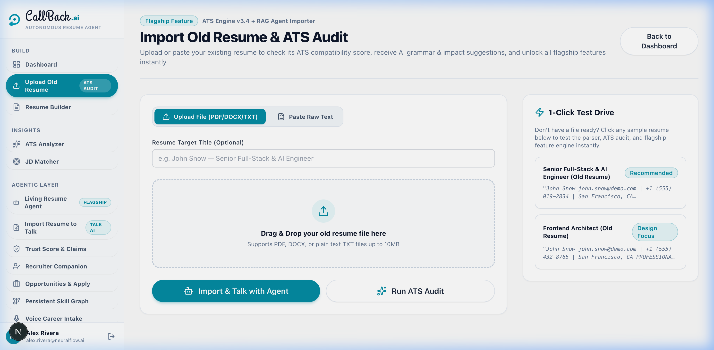

- **Multi-Format Extraction**: Ingests PDF, DOCX, and TXT files with automated entity extraction and instant ATS pre-flight scoring.

---

## 🏛️ Codebase Architecture & Directory Structure

```text
CallBack.ai/
├── app/                               # Next.js 16 App Router & Serverless API Routes
│   ├── (app)/                         # Protected Product Workspaces
│   │   ├── agent/[resumeId]/          # Living Candidate Agent Workspace (2-Column)
│   │   ├── analyzer/[resumeId]/       # Deep ATS Analyzer & Audit Dashboard
│   │   ├── builder/[resumeId]/        # 3-Zone Interactive Resume Builder
│   │   ├── dashboard/                 # Candidate Portfolio Hub
│   │   ├── import-resume/             # Binary PDF/DOCX Text Extractor & Importer
│   │   ├── jd-match/[resumeId]/       # Job Description Matcher & Keyword Gap Tool
│   │   ├── opportunities/             # Auto-Tailor Job Matches & Opportunities
│   │   ├── recruiter-dashboard/       # Recruiter Evaluation Companion
│   │   ├── skill-graph/               # Persistent Verified Skill Graph
│   │   ├── trust-score/[resumeId]/    # Claim Verification & Authenticity Engine
│   │   └── voice-intake/              # Voice-Native Audio Career Intake
│   ├── (auth)/                        # Authentication Workspaces (Login & Register)
│   ├── api/                           # Backend Serverless REST Endpoints
│   │   ├── agent/[resumeId]/chat/     # RAG Agent Chat Streaming API
│   │   ├── ai/enhance-bullet/         # AI Action Verb & Metric Enhancer
│   │   ├── match/                     # Job Description Fit Scoring API
│   │   ├── resumes/                   # CRUD & File Upload Import Endpoints
│   │   └── verification/              # Trust Score & Public Verification API
│   ├── globals.css                    # Design Tokens & ATS A4 Print Stylesheet
│   ├── layout.tsx                     # Root Layout & Font Definitions
│   └── page.tsx                       # High-Converting Hero Landing Page
│
├── backend/                           # Backend Business Logic & AI Services
│   └── services/
│       ├── rag-agent-service.ts       # RAG Pipeline & Semantic Knowledge Retrieval
│       └── verification-service.ts    # Public Claim & Timeline Verification Logic
│
├── components/                        # Reusable Frontend Components
│   ├── builder/
│   │   └── ResumeTemplates.tsx        # 40+ ATS Vector Template Layout Engine
│   ├── nav/
│   │   └── Sidebar.tsx                # Unified App Navigation Sidebar
│   └── ui/                            # Design System Atoms (Buttons, Modals, Inputs, Cards)
│       ├── Button.tsx
│       ├── Card.tsx
│       ├── ChatBubble.tsx
│       ├── Input.tsx
│       └── Modal.tsx
│
├── database/                          # Database Connection & Singleton
│   └── db.ts                          # Prisma Database Client Singleton
│
├── lib/                               # Core Utilities & Shared Logic
│   └── services/
│       ├── ats-service.ts             # ATS Heuristics & Scoring Engine
│       ├── document-parser.ts         # Binary PDF & DOCX Stream Extractor
│       └── resume-importer.ts         # Regex & Semantic Resume Parser
│
├── prisma/                            # Database Schema & Migrations
│   ├── schema.prisma                  # SQLite / PostgreSQL Relational Models
│   └── seed.ts                        # High-Caliber Mock Persona Seed Data
│
└── public/                            # Static Assets, Icons & Screenshots
    └── screenshots/                   # Live 2x Retina Screenshots of App Workspaces
```

---

## 🎨 40+ Production ATS Template Engine

All templates render standard vector output adhering to ISO A4 dimensions (`210mm × 297mm`) with single-page print optimization:

| Category | Key Templates | Highlights |
| :--- | :--- | :--- |
| **Executive & Corporate** | `classic_ats`, `fortune500_single`, `boardroom_serif` | 99% ATS compatibility, standard serif/sans typography, full-width bullet grid |
| **Tech & Systems** | `minimalist_tech`, `cloud_architect`, `rust_systems` | Monospace terminals, system architecture highlights, tech stack badges |
| **Startups & High Growth** | `modern_executive`, `yc_founder_pitch`, `stealth_scale` | Terracotta left accents, leadership summary callouts, venture metrics |
| **Symmetrical Multi-Column** | `navy_sidebar`, `split_duo`, `right_sidebar` | Deep navy sidebars, 68/32 split layouts, tabular date alignments |
| **Editorial & Strategy** | `mckinsey_consulting`, `swiss_grid`, `oxford_academic` | Clean editorial rules, high-density academic formats |

---

## 🤖 Living Candidate RAG Agent Engine

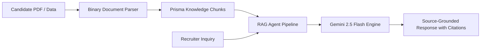

1. **Document Ingestion**: Extracts text chunks from resume sections and indexes them in the database.
2. **Contextual Retrieval**: On each recruiter prompt, the agent searches relevant experience and project bullets.
3. **Strict Grounding**: Uses zero-temperature inference to guarantee answers reflect verified work history without hallucinations.

---

## 📄 Binary Document Parsing Engine (PDF/DOCX)

`lib/services/document-parser.ts` decodes binary file streams:
- **PDF Extraction**: Uses `pdf2json` to extract raw text buffers from uploaded PDFs.
- **DOCX Extraction**: Uses `mammoth` to extract clean plain text from Microsoft Word documents.
- **Semantic Normalization**: Maps candidate headers, employment dates, roles, and skills into structured JSON for the database.

---

## 🛠️ Full Backend REST API Specification

| Method | Endpoint | Description |
| :--- | :--- | :--- |
| `POST` | `/api/resumes/import` | Handles `multipart/form-data` uploads (PDF, DOCX) and parses text into structured resume sections |
| `POST` | `/api/agent/[resumeId]/chat` | Executes RAG query against candidate knowledge base with source citations |
| `POST` | `/api/ai/enhance-bullet` | Enhances bullet points with strong action verbs and quantified impact metrics |
| `POST` | `/api/match` | Compares resume against job description to compute fit score and missing keywords |
| `GET` | `/api/verification/[resumeId]` | Returns verified claims, trust scores, and timeline consistency metrics |
| `GET` | `/api/resumes/[id]` | Retrieves full resume document, sections, and active layout metadata |
| `PUT` | `/api/sections/[id]` | Updates content for a specific resume section |
| `POST` | `/api/sections/reorder` | Updates display order of sections in the database |

---

## 💻 Tech Stack & Infrastructure

- **Frontend & Fullstack**: Next.js 16 (Turbopack, App Router, React 19)
- **Language**: TypeScript 5.0 (Strict mode enabled)
- **Styling**: Tailwind CSS v4 with custom design tokens
- **Database & ORM**: Prisma ORM 5.22 with SQLite / PostgreSQL (`DATABASE_URL`)
- **Document Parsers**: `pdf2json`, `mammoth`
- **AI Inference**: Google Gemini API (`GEMINI_API_KEY`)
- **Icons & Motion**: Lucide React, Tailwind Micro-Animations

---

## 🚀 Local Development Setup

### Prerequisites
- Node.js 18.17.0+ or Node.js 20+
- npm, pnpm, or yarn

### 1. Clone & Install Dependencies
```bash
git clone https://github.com/CodeNova-Ayush/CallBack.ai.git
cd CallBack.ai
npm install
```

### 2. Configure Environment Variables
Create a `.env` file in the project root:
```env
DATABASE_URL="file:./dev.db"
GEMINI_API_KEY="your-google-gemini-api-key"
NEXT_PUBLIC_APP_URL="http://localhost:3000"
```

### 3. Initialize & Seed Database
```bash
npx prisma generate
npx prisma db push --accept-data-loss
npx tsx prisma/seed.ts
```

### 4. Start Development Server
```bash
npm run dev
```
Open [http://localhost:3000](http://localhost:3000) in your browser.

---

## 🚢 Deploying to Vercel

1. Push your repository to GitHub:
   ```bash
   git push origin main
   ```
2. Import the repository into **[Vercel](https://vercel.com/)**.
3. Set the Environment Variables in the Vercel Project Settings:
   - `DATABASE_URL` (e.g. Postgres / Supabase / Neon / SQLite)
   - `GEMINI_API_KEY`
   - `NEXT_PUBLIC_APP_URL`
4. Deploy! Next.js will automatically build and deploy the production bundle.

---

## 📄 License
This project is licensed under the **MIT License**.
